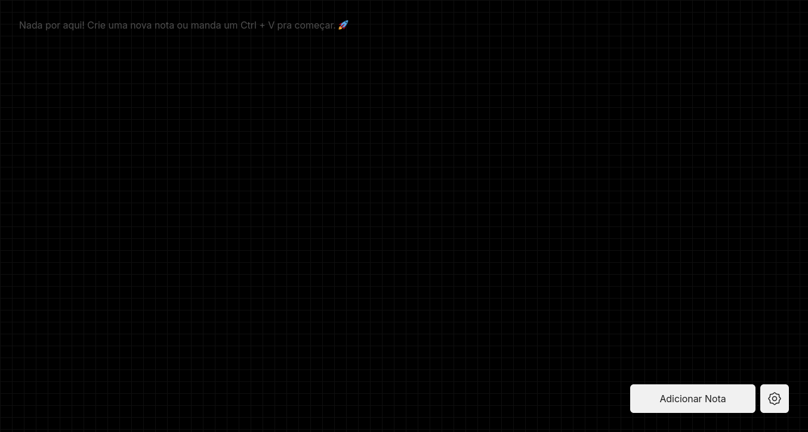

# Paste Note 📝

Paste Note é uma aplicação Node.js que permite aos usuários adicionar e gerenciar anotações de forma rápida e intuitiva. A interface web permite colar textos diretamente (Ctrl + V) ou adicioná-los manualmente com um botão.

## 🚀 Funcionalidades

- ✅ Interface web simples e intuitiva
- ✅ Identificação por username
- ✅ Adição rápida de notas via colagem (Ctrl + V) ou botão
- ✅ Armazenamento eficiente de anotações

## 🛠 Requisitos

- Node.js v22.13.1 ou superior

## 📦 Como executar

1. Clone este repositório:
  ```bash
  git clone https://github.com/lucasfernandodev/paste-notes
  cd paste-note
  ```

2. Instale as dependências:
  ```bash
  npm install
  ```

3. Inicie a aplicação:
  ```
  http://localhost:3000
  ```

## 📜 Como usar

1. Insira um username para identificar suas anotações.
2. Cole (Ctrl + V) ou use o botão para adicionar novas notas.
2. Suas notas serão listadas na tela para fácil acesso.